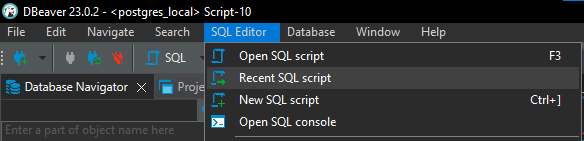
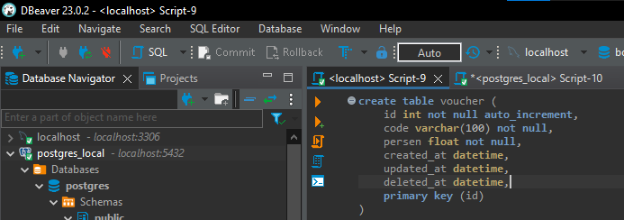
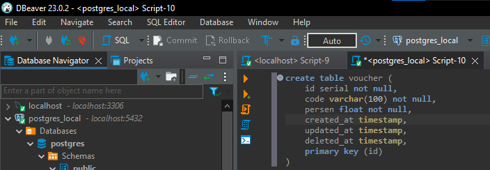

# Create Table in MySQL or PostgreSQL

## This directory is for storing the SQL code used to create the tables in MySQL or PostgreSQL that are required in this repo

## Prerequisite

- DBBeaver (RDBMS)
- MySQL or PostgreSQL

## Usage

Copy each code from SQL_1 to SQL_n from MySQL or PostgreSQL code in another DBeaver or RDBMS, and then run it.

